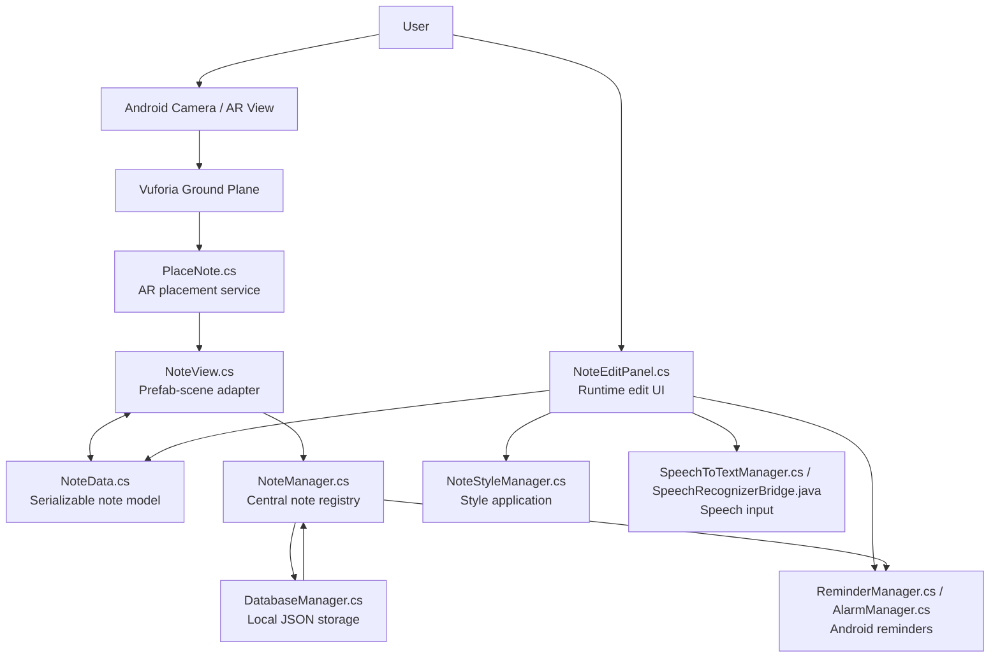
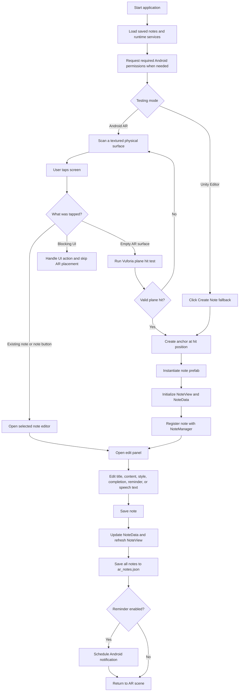

# Technical Report: AR Note Team Handoff

## Member 1: Introduction, Motivation, and Objectives

### 1. Introduction

This project is an Android-based augmented reality (AR) note-taking and task reminder application developed with Unity, Vuforia Engine, C#, and Android platform services. The application allows users to place digital sticky notes in the physical environment, edit them as tasks, customize their appearance, set local reminders, and add note content through speech-to-text input.

The main idea of the project is contextual task management. Instead of storing reminders only in a conventional list, users can attach information to real-world locations or objects. For example, a user may place a note near a desk to remember a work task, near a door to remember an item before leaving, or near a computer to keep a technical reminder visible in the relevant workspace. This makes the note more meaningful because the reminder is spatially connected to the place where the task should be completed.

AR is relevant in science and technology because it combines computer vision, human-computer interaction, mobile sensing, 3D graphics, and software engineering. Classic AR research describes AR systems as systems that combine real and virtual objects, support real-time interaction, and align virtual content with the real world. In this project, these ideas are implemented through a mobile AR scene where virtual notes are rendered over the camera view and positioned using detected physical surfaces.

The application uses Vuforia Ground Plane for AR placement. Ground Plane technology supports placing digital content on detected real-world surfaces by using device tracking and hit-test results. In the project code, `PlaceNote.cs` receives touch or mouse input, checks whether the user is interacting with UI or an existing note, and then performs a Vuforia plane hit test. When an anchor is created, the note prefab is instantiated at the detected position and initialized through `NoteView.cs`.

### 2. Project Motivation

Many people use digital notes, calendars, alarms, or task applications, but these tools are often separated from the physical context of the task. A reminder such as "submit the report" or "take the notebook" may appear in a list, but it does not necessarily appear at the place where the user needs it. This creates a gap between digital task management and real-world action.

The team selected this topic because AR can reduce that gap. By placing notes in the physical environment, the application makes reminders more contextual, visible, and memorable. The project also provides a practical way to explore several important areas of science and technology, including AR tracking, mobile application development, data persistence, speech recognition, notification scheduling, and collaborative software architecture.

The potential impact of the application is strongest in everyday productivity and team handoff scenarios. Users can leave spatial instructions, task labels, or reminders near relevant objects. In workplace, laboratory, classroom, or home environments, this could support maintenance instructions, study reminders, shared task notes, or object-specific annotations.

### 3. Objectives and Achievements

The planned objectives were:

1. Develop an Android AR application that can place digital notes in the real environment.
2. Support note creation, editing, deletion, selection, completion, visibility control, and persistence.
3. Save note data locally so notes can be restored after restarting the application.
4. Add note styling, including color labels, icons, and priority indicators.
5. Add Android local reminders for note-based tasks.
6. Add speech-to-text input for note content.
7. Provide an editor testing flow so core features can be tested without depending on AR plane detection.

The final project achieved these goals through the following completed features:

| Planned goal | Final outcome | Evidence in project |
| --- | --- | --- |
| AR note placement | Implemented through Vuforia hit testing and runtime note anchors | `Assets/Scripts/AR/PlaceNote.cs` |
| Editor fallback note creation | Implemented through center-screen note creation | `PlaceNote.CreateCenterScreenNote()` |
| CRUD task management | Implemented through centralized note registry | `Assets/Scripts/Managers/NoteManager.cs` |
| Local persistence | Implemented using JSON saved to `Application.persistentDataPath/ar_notes.json` | `Assets/Scripts/Managers/DatabaseManager.cs` |
| Note visual display | Implemented through note prefab adapter and automatic refresh | `Assets/Scripts/AR/NoteView.cs` |
| Styling | Implemented with colors, icons, and priorities | `Assets/Scripts/Styling/NoteStyleManager.cs` and `StylePanelController.cs` |
| Reminders | Implemented with Android notifications, repeat rules, snooze, and dismiss support | `Assets/Scripts/Managers/ReminderManager.cs` and `AlarmManager.cs` |
| Speech-to-text | Implemented using Android speech recognition bridge | `Assets/Scripts/Managers/SpeechToTextManager.cs` and `Assets/Plugins/Android/SpeechRecognizerBridge.java` |

Overall, the project successfully produced a functional AR task note prototype. Some features, such as AR tracking, microphone input, speech recognition, and notification delivery, require real Android device testing because they depend on physical sensors and Android runtime permissions.

## Member 2: Methodology, System Design, and Development

### 4. Methodology

#### 4.1 Development Environment

The application was developed as a Unity Android project. The main development technologies were:

| Category | Technology |
| --- | --- |
| Game engine and editor | Unity 2021.3.45f2 |
| Main programming language | C# |
| AR SDK | Vuforia Engine, including Ground Plane and `PlaneFinderBehaviour` |
| Mobile platform | Android |
| Android native integration | Java plugin through `Assets/Plugins/Android` |
| UI system | Unity UI, TextMeshPro, runtime canvas elements |
| Persistence | Unity `JsonUtility`, local file I/O, `Application.persistentDataPath` |
| Notifications | Unity Mobile Notifications package for Android |
| Speech input | Android `SpeechRecognizer` through a Java bridge |
| Collaboration | Git/GitHub repository handoff workflow |

#### 4.2 System Architecture

The system follows a modular architecture. Each feature module communicates through shared data and manager classes rather than directly controlling other modules.



#### 4.3 Core Implementation Process

The development process followed these steps:

1. Create the Unity scene and configure Android/Vuforia project settings.
2. Build AR note placement through `PlaceNote.cs`, including touch handling, Vuforia hit tests, anchor creation, and note prefab instantiation.
3. Define the shared data model in `NoteData.cs`, including task fields, visual style fields, reminder fields, transcript fields, and AR world position/rotation.
4. Implement `NoteManager.cs` as the central note service for add, update, delete, select, retrieve, and save operations.
5. Implement `DatabaseManager.cs` for local JSON persistence.
6. Implement `NoteView.cs` to connect saved `NoteData` with the visible AR note prefab.
7. Implement the runtime edit UI in `NoteEditPanel.cs`.
8. Add styling controls and visual application through `StylePanelController.cs` and `NoteStyleManager.cs`.
9. Add reminder scheduling using `ReminderManager.cs` and `AlarmManager.cs`.
10. Add Android speech recognition using `SpeechToTextManager.cs` and `SpeechRecognizerBridge.java`.
11. Prepare editor and Android testing guides for team handoff.

#### 4.4 Key Source Code Excerpts and Technical Explanation

**AR placement and note creation**

```csharp
public void AnchorCreated(HitTestResult result)
{
    if (result == null || notePrefab == null) return;

    Quaternion finalRotation = CalculateReadableRotation(result);
    CreateNoteAt("NoteAnchor", result.Position, finalRotation, true, "New Note", "");
}
```

This method is called after Vuforia finds a valid hit-test result. It calculates a readable note rotation, creates an anchor, instantiates the note prefab, initializes note data, and registers the note through the note management system.

**Note data model**

```csharp
[System.Serializable]
public class NoteData
{
    public string id;
    public string title;
    public string content;
    public bool isCompleted;
    public bool isVisible = true;
    public string colorName;
    public string iconId;
    public string priorityId;
    public bool hasReminder;
    public string reminderTime;
    public bool hasTranscript;
    public string transcriptText;
    public Vector3 worldPosition;
    public Vector3 worldRotation;
}
```

`NoteData` is the shared data contract. It stores not only note text but also task state, visual style, reminder state, speech transcript metadata, and AR pose. This allows notes to be saved and restored after restarting the app.

**Central update and persistence flow**

```csharp
public void UpdateNote(NoteData note)
{
    if (note == null) return;

    note.ApplyDefaults();
    int index = allNotes.FindIndex(n => n.id == note.id);
    if (index < 0)
    {
        AddNote(note);
        return;
    }

    allNotes[index] = note;
    if (activeViews.TryGetValue(note.id, out NoteView view))
        view.RefreshFromData();

    ReminderManager.Instance?.ScheduleOrCancel(note);
    SaveNotes();
}
```

This code shows the central update pattern. When note data changes, `NoteManager` updates the in-memory list, refreshes the active AR view, schedules or cancels reminders, and saves the full note list to JSON.

**Local JSON persistence**

```csharp
string json = JsonUtility.ToJson(collection, true);
File.WriteAllText(SaveFilePath, json);
```

The project uses Unity's `JsonUtility` and local file I/O to save notes as structured JSON. The save path is `Application.persistentDataPath/ar_notes.json`, which is suitable for app-specific persistent data.

**Speech-to-text bridge**

```csharp
using (AndroidJavaClass bridge = new AndroidJavaClass("com.arnote.speech.SpeechRecognizerBridge"))
{
    bridge.CallStatic("startListening", callbackObjectName, "OnSpeechResult", "OnSpeechError");
}
```

The Unity C# layer calls a Java bridge class. The Java bridge starts Android speech recognition and sends the recognized text back to Unity with `UnityPlayer.UnitySendMessage`.

#### 4.5 HTA Diagram

```mermaid
flowchart TD
    T0["0. Manage a contextual AR task note"]

    T0 --> T1["1. Start AR note session"]
    T0 --> T2["2. Create or select a note"]
    T0 --> T3["3. Edit note information"]
    T0 --> T4["4. Configure task aids"]
    T0 --> T5["5. Save and restore note"]

    T1 --> T11["1.1 Launch Android app or Unity Play Mode"]
    T1 --> T12["1.2 Load MainScene"]
    T1 --> T13["1.3 Restore saved notes from local JSON"]
    T1 --> T14["1.4 Reschedule saved reminders"]

    T2 --> T21["2.1 Scan real surface with camera"]
    T2 --> T22["2.2 Tap detected surface for Vuforia hit test"]
    T2 --> T23["2.3 Use Create Note fallback when plane detection is unavailable"]
    T2 --> T24["2.4 Tap existing note to select it"]

    T3 --> T31["3.1 Open edit panel"]
    T3 --> T32["3.2 Enter title"]
    T3 --> T33["3.3 Enter content"]
    T3 --> T34["3.4 Mark complete or visible"]
    T3 --> T35["3.5 Delete note if needed"]

    T4 --> T41["4.1 Select color"]
    T4 --> T42["4.2 Select icon"]
    T4 --> T43["4.3 Select priority"]
    T4 --> T44["4.4 Set reminder time"]
    T4 --> T45["4.5 Add speech-to-text content"]

    T5 --> T51["5.1 Update NoteData"]
    T5 --> T52["5.2 Refresh NoteView"]
    T5 --> T53["5.3 Save through NoteManager"]
    T5 --> T54["5.4 Write ar_notes.json"]
    T5 --> T55["5.5 Reopen app and restore AR anchors"]
```



#### 4.6 Main User Flowchart



#### 4.7 Storyboard

| Scene | User action | System response |
| --- | --- | --- |
| 1 | User opens the app | Camera-based AR scene starts |
| 2 | User moves phone over a surface | Vuforia detects trackable ground plane |
| 3 | User taps the detected surface | A sticky note appears in AR |
| 4 | User taps the note or Edit button | Runtime edit panel opens |
| 5 | User enters title/content or taps microphone | Text is saved or appended from speech recognition |
| 6 | User selects color/icon/priority | Note style updates visually |
| 7 | User sets a reminder | Android notification is scheduled |
| 8 | User restarts the app | Saved notes are restored from JSON with position and styling |

## Member 3: Testing, Debugging, and User Evaluation

### 5. Quality Assurance

Testing was divided into editor testing and Android device testing. This separation was necessary because some features can be validated in Unity Play Mode, while AR tracking, camera permissions, microphone permissions, notification delivery, and speech recognition require a physical Android device.

#### 5.1 Editor Testing

The Unity Editor test flow was:

1. Open `Assets/Scenes/MainScene.unity`.
2. Press Play.
3. Confirm no red compile or runtime errors appear in the Console.
4. Click `Create Note` to create a center-screen test note without Vuforia plane detection.
5. Open the edit panel and test title, content, completion, visibility, reminder fields, style fields, and speech field behavior where available.
6. Click Save.
7. Stop Play Mode and enter Play Mode again.
8. Confirm saved notes restore from local JSON.

#### 5.2 Functional Test Cases

| Test case | Expected result | Pass criteria |
| --- | --- | --- |
| Create note | New note appears in AR/editor scene | Note prefab is visible and selected |
| Edit note | User can update title and content | Reopened note shows latest text |
| Delete note | Selected note is removed | Note disappears and is removed from saved data |
| Complete note | Note can be marked completed | Title displays completion state and visibility is updated |
| Style note | Color, icon, and priority can be changed | Visual style matches selected data |
| Save/load | Notes persist after restart | Notes are restored from `ar_notes.json` |
| Reminder | Future reminder is scheduled | Android notification appears at selected time |
| Speech-to-text | Speech text is appended to note content | Recognized text appears in content field |

#### 5.3 Device and AR Tracking Testing

Android testing should be performed using this flow:

1. Build and run the application on an Android device.
2. Accept camera, microphone, notification, and exact alarm permission prompts.
3. Move the phone slowly over a textured surface with good lighting.
4. Tap the detected surface to place a note.
5. Edit and save note content.
6. Set a future reminder and verify notification delivery.
7. Use speech input and verify recognized text is appended.
8. Close and reopen the app to verify restoration of notes, positions, styles, reminders, and transcript fields.

#### 5.4 Bugs, Root Causes, and Solutions

| Issue | Evidence or symptom | Root cause | Solution implemented |
| --- | --- | --- | --- |
| UI taps could accidentally trigger AR placement | Touching UI could create a note behind the panel | AR touch handling did not fully separate UI raycasts from plane hit tests | `PlaceNote.HandleBlockingUiTap()` checks UI elements before running Vuforia hit tests |
| Editor testing depended too much on plane detection | Difficult to test CRUD without Android AR tracking | Vuforia Ground Plane requires supported device behavior | `CreateCenterScreenNote()` creates a camera-relative fallback note in Play Mode |
| Duplicate note IDs could conflict at runtime | Multiple note views could reference the same saved ID | Restored or instantiated notes may share data IDs | `NoteManager.RegisterView()` detects duplicate IDs and assigns a new GUID |
| Reminder time could be in the past | Notification would not fire correctly | User-selected time may be earlier than current device time | `NoteEditPanel.Save()` moves invalid past reminders to at least one minute in the future |
| Android speech recognition may fail without permission | Dictation does not start | Microphone permission is required by Android | `SpeechToTextManager` requests microphone permission before starting dictation |
| Speech recognizer resources could remain active | Repeated speech input could become busy | Android recognizer must be stopped and destroyed | `SpeechRecognizerBridge.java` releases the recognizer after results or errors |

Suggested screenshots for appendix:

| Screenshot label | Required evidence |
| --- | --- |
| Appendix A | Unity scene with `Create Note`, `Edit Note`, and `Clear DB` buttons |
| Appendix B | AR note placed on a physical surface |
| Appendix C | Runtime edit panel with title/content fields |
| Appendix D | Style selection with color/icon/priority |
| Appendix E | Android notification generated by a reminder |
| Appendix F | Speech-to-text result appended to note content |
| Appendix G | Console/debug log evidence for save/load or error handling |

### 6. User Evaluation

The recommended user evaluation method is a small usability test with 5-10 participants. Each participant should complete a task scenario and then provide feedback through observation notes and a short questionnaire.

#### 6.1 Evaluation Procedure

1. Explain the purpose of the AR note application.
2. Ask the participant to create a note in AR or by using the fallback button.
3. Ask the participant to edit the note title and content.
4. Ask the participant to apply a style and priority.
5. Ask the participant to set a reminder.
6. Ask the participant to test speech input if using an Android device.
7. Record completion success, time taken, errors, and comments.
8. Collect questionnaire ratings from 1 to 5.

#### 6.2 Example Evaluation Metrics

| Metric | Description |
| --- | --- |
| Task success rate | Percentage of users who complete the task without assistance |
| Average completion time | Time needed to create and save a contextual AR note |
| Ease of placement | User rating for AR note placement |
| Ease of editing | User rating for note editing UI |
| Reminder usefulness | User rating for notification/reminder value |
| Speech input usefulness | User rating for dictation feature |
| Overall satisfaction | General rating of the application experience |

#### 6.3 Evaluation Results Template

| Participant | Create note | Edit note | Style note | Set reminder | Speech input | Satisfaction /5 | Comments |
| --- | --- | --- | --- | --- | --- | --- | --- |
| P1 | Pass | Pass | Pass | Pass | Pass/Fail |  |  |
| P2 | Pass | Pass | Pass | Pass | Pass/Fail |  |  |
| P3 | Pass | Pass | Pass | Pass | Pass/Fail |  |  |

The final report should replace this template with collected user results. Based on the current implementation, expected findings include that users can understand the purpose of contextual AR notes quickly, while AR tracking quality may depend strongly on lighting, surface texture, and device support.

## Member 4: Challenges, Conclusion, References, and Appendices

### 7. Challenges and Solutions

#### 7.1 Technical Challenges

The first major challenge was AR placement reliability. Plane detection depends on environmental conditions such as lighting, surface texture, camera movement, and hardware support. The solution was to use Vuforia Ground Plane for physical testing and also implement a center-screen fallback note creation method for Unity Editor testing.

The second challenge was separating AR touch input from UI interaction. Since the same screen receives both AR placement taps and UI button/input actions, accidental note placement could occur when the user touched the edit panel. The solution was to use UI raycast checks in `PlaceNote.cs` before performing AR hit tests.

The third challenge was data consistency. Notes contain text, style, reminders, speech transcript metadata, and AR pose. If each feature saved data independently, the project could become inconsistent. The solution was to use `NoteData` as the shared data contract, `NoteManager` as the central update gateway, and `DatabaseManager` as the only JSON persistence service.

The fourth challenge was Android-specific functionality. Notifications, exact alarms, microphone permission, and speech recognition all depend on Android permissions and platform behavior. The solution was to isolate these features in `AlarmManager.cs`, `ReminderManager.cs`, `SpeechToTextManager.cs`, and `SpeechRecognizerBridge.java`.

#### 7.2 UI/UX and AR Challenges

The main UI/UX challenge was making note editing simple while still supporting many features. The edit panel needed to include text input, completion state, reminder time selection, style selection, and microphone input. The solution was to centralize the note editing workflow in `NoteEditPanel.cs` and keep visual feedback updated through selection states.

The main AR UX challenge was note readability. A note placed on a detected surface must face a readable direction. The project handles this through `CalculateReadableRotation()` in `PlaceNote.cs`, which uses the surface normal or camera direction to orient notes.

#### 7.3 Team Collaboration Challenges

The project required several modules to work together: AR placement, CRUD/persistence, styling, reminders, and speech input. A collaboration risk was that one member could accidentally duplicate another member's logic. The team addressed this through a handoff structure that clearly defines shared interfaces and ownership boundaries. For example, all modules update selected notes through `NoteView.SaveAndRefresh()` or `NoteManager.UpdateNote()` rather than writing directly to the database.

#### 7.4 Lessons Learned

The project demonstrated that AR applications require both technical and interaction design thinking. It is not enough to render a virtual object; the system must also handle device permissions, input conflicts, data persistence, and real-world testing conditions. The team also learned that modular architecture is important in group development because it reduces merge conflicts and keeps each feature easier to test.

### 8. Conclusion

The project successfully developed a functional AR note and task reminder prototype for Android. Users can create notes in an AR environment, edit them, style them, set reminders, use speech-to-text input, and restore saved notes after restarting the application. The project combines AR tracking, mobile UI, persistent storage, Android notifications, and Android speech recognition in one integrated system.

The final outcome meets the main objectives of the project. It demonstrates how AR can improve task management by connecting digital reminders with physical context. Although further usability testing and polishing are still needed, the system provides a strong foundation for future development.

Future improvements may include cloud synchronization, multi-user shared notes, image-based note anchors, richer voice commands, improved cross-device speech recognition support, analytics for user evaluation, and a more polished production UI.

### 9. References

Android Developers. (2026). *SpeechRecognizer*. Android API reference. https://developer.android.com/reference/android/speech/SpeechRecognizer

Azuma, R. T. (1997). A survey of augmented reality. *Presence: Teleoperators and Virtual Environments, 6*(4), 355-385. https://direct.mit.edu/pvar/article-pdf/6/4/355/1623026/pres.1997.6.4.355.pdf

Milgram, P., & Kishino, F. (1994). A taxonomy of mixed reality visual displays. *IEICE Transactions on Information and Systems, E77-D*(12), 1321-1329. https://web.cs.wpi.edu/~gogo/courses/cs525H_2010f/papers/Milgram_IEICE_1994.pdf

Unity Technologies. (2021). *Android environment setup*. Unity Manual. https://docs.unity3d.com/Manual/android-sdksetup.html

Unity Technologies. (2024). *JSON serialization*. Unity Manual. https://docs.unity3d.com/Manual/json-serialization.html

Unity Technologies. (2026). *Push Notifications*. Unity Documentation. https://docs.unity.com/en-us/push-notifications

Vuforia. (2026). *Ground Plane*. Vuforia Engine Library. https://developer.vuforia.com/library/vuforia-engine/environments/ground-plane/ground-plane/

Vuforia. (2026). *Introduction to Ground Plane in Unity*. Vuforia Engine Library. https://developer.vuforia.com/library/vuforia-engine/environments/ground-plane/introduction-ground-plane-unity/

### 10. Appendices

#### Appendix A: User Manual

1. Open the application on an Android device.
2. Accept required permissions.
3. Move the phone slowly over a textured surface.
4. Tap a detected surface to create an AR note.
5. Tap the note or the Edit Note button to open the edit panel.
6. Enter note title and content.
7. Select color, icon, and priority if needed.
8. Enable reminder and select a future time if needed.
9. Tap the microphone button to add speech-to-text content if needed.
10. Save the note.
11. Reopen the app to confirm the note is restored.

#### Appendix B: Technical Evidence Checklist

| Appendix item | Description | File or evidence source |
| --- | --- | --- |
| B1 | AR placement script | `Assets/Scripts/AR/PlaceNote.cs` |
| B2 | Note view adapter | `Assets/Scripts/AR/NoteView.cs` |
| B3 | Shared note model | `Assets/Scripts/Data/NoteData.cs` |
| B4 | Note CRUD manager | `Assets/Scripts/Managers/NoteManager.cs` |
| B5 | JSON persistence | `Assets/Scripts/Managers/DatabaseManager.cs` |
| B6 | Reminder scheduling | `Assets/Scripts/Managers/ReminderManager.cs`, `AlarmManager.cs` |
| B7 | Speech-to-text | `Assets/Scripts/Managers/SpeechToTextManager.cs`, `Assets/Plugins/Android/SpeechRecognizerBridge.java` |
| B8 | Testing checklist | `CRUD_TEST_GUIDE.md`, `SIMULATION_GUIDE.md` |

#### Appendix C: Member Task Distribution Summary

| Member | Main report responsibility | Suggested project evidence |
| --- | --- | --- |
| Member 1 | Introduction, motivation, objectives, achievements | README, AR feature overview, references |
| Member 2 | Methodology, system design, development workflow, diagrams | Core scripts and architecture diagrams |
| Member 3 | Testing, debugging, user evaluation | Test guides, Android screenshots, bug table, user feedback |
| Member 4 | Challenges, conclusion, references, appendices | Team handoff document, lessons learned, APA reference list |
